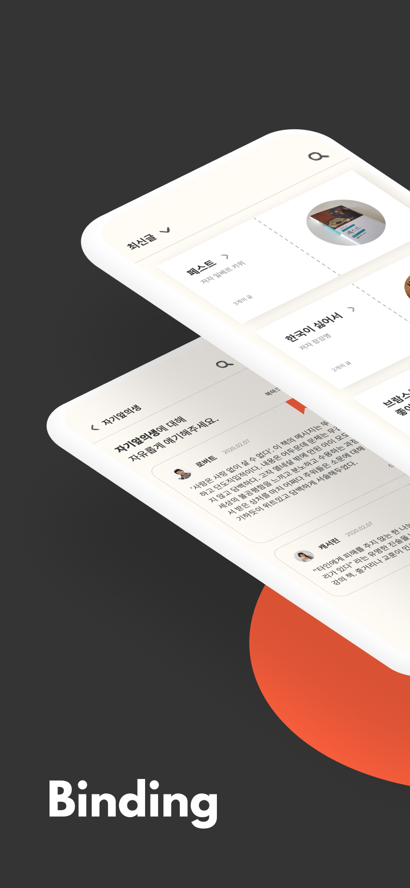
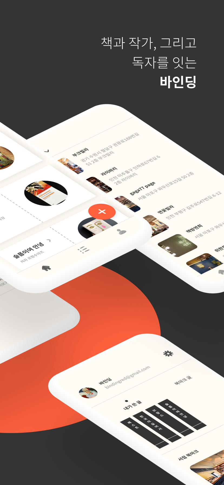
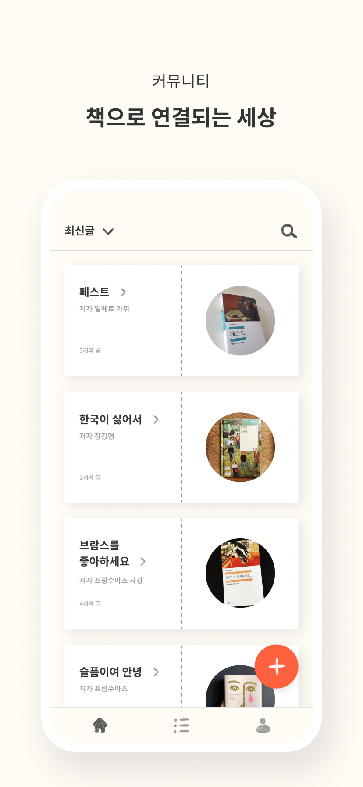
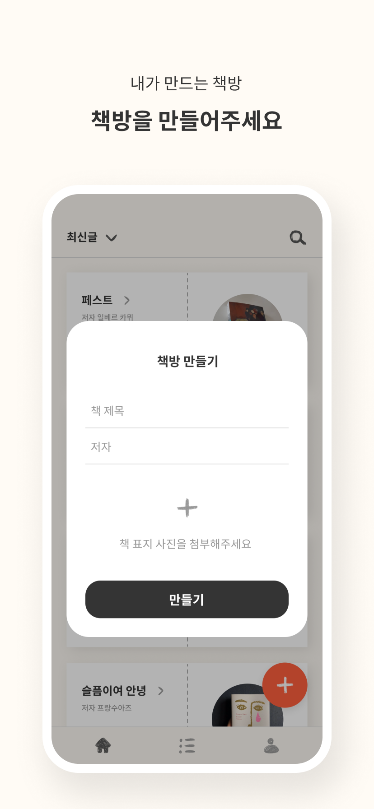
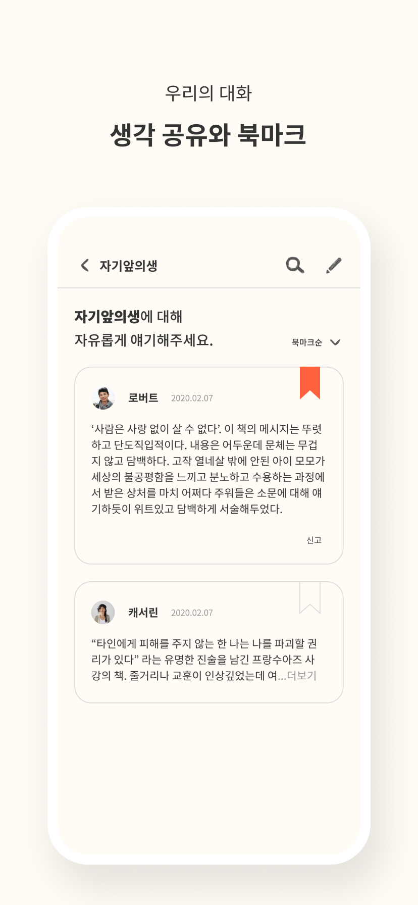
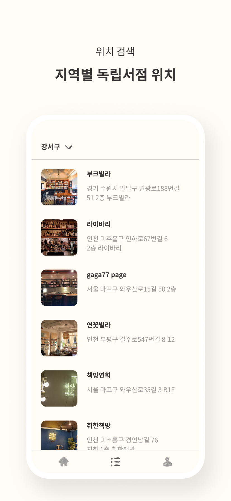
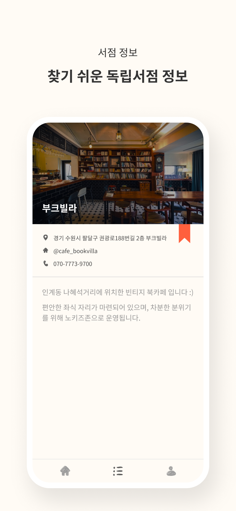
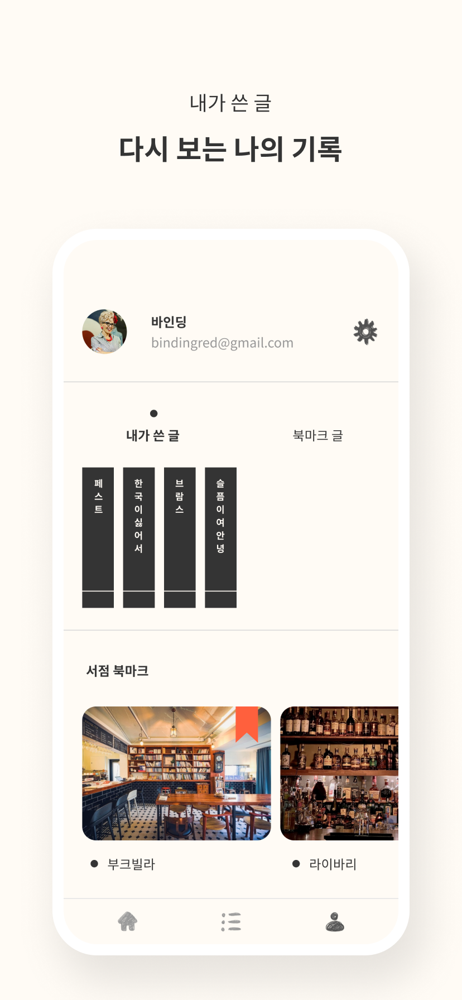

# MakeUs 6기 APP 런칭 프로젝트

### 수익형 앱 런칭 동아리 MakeUs에서 Application 런칭 프로젝트에 사용된 백엔드 코드입니다.
>What's MakeUs ?  👉  https://www.makeus.in
---
## Stacks

---
## What's Binding

 

 
 
 

---

## License
본 템플릿은 MakeUs에 소유권이 있으며 본 자료에 대한 상업적 이용 및 무단 복제,배포 및 변경을 원칙적으로 금지하며 이를 위반할 때에는 형사처벌을 받을 수 있습니다.

